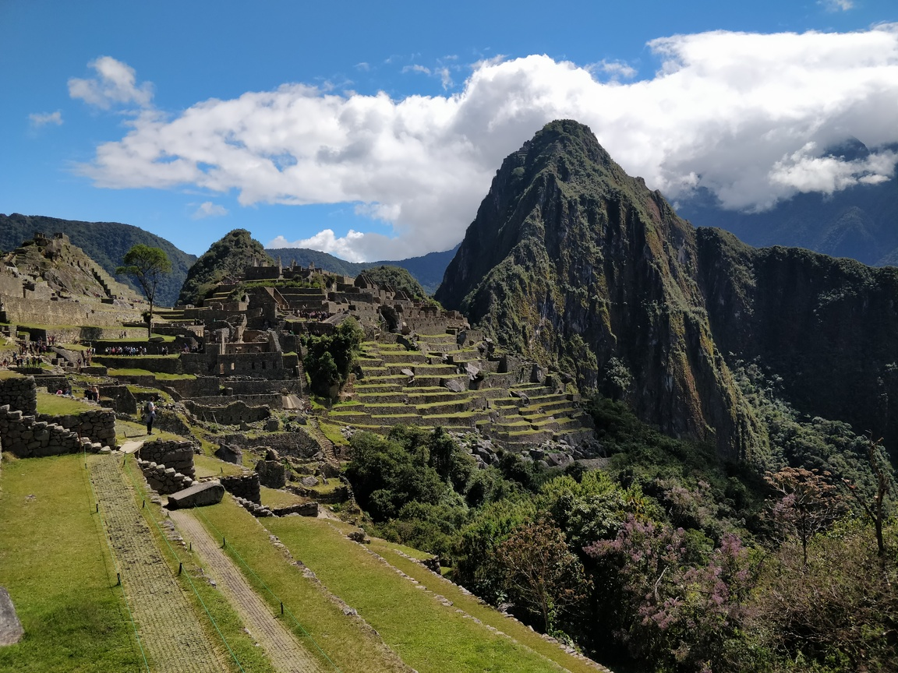
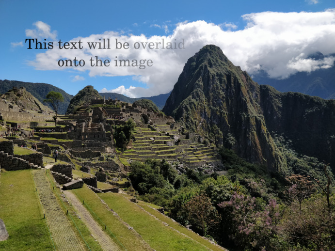

# Raspberry Pi NEON Compositor

Uses NEON SIMD instructions to overlay a foreground image with an alpha channel
(transparency) over a background image really quickly.

## Documentation

[**Documentation**](https://tttapa.github.io/ARM-NEON-Compositor/Doxygen/index.html)

The [**modules**](https://tttapa.github.io/ARM-NEON-Compositor/Doxygen/modules.html)
page is the best place to start.

You can find more in-depth explanations of the NEON intrinsics used by this 
library here: [**Raspberry-Pi/NEON**](https://tttapa.github.io/Pages/Raspberry-Pi/NEON/index.html).

## Examples

The `overlay_alpha` example overlays a foreground image with an alpha channel 
onto a background image, for example:

| Background | Foreground | Result |
|:----------:|:----------:|:------:|
|  |  |  |
