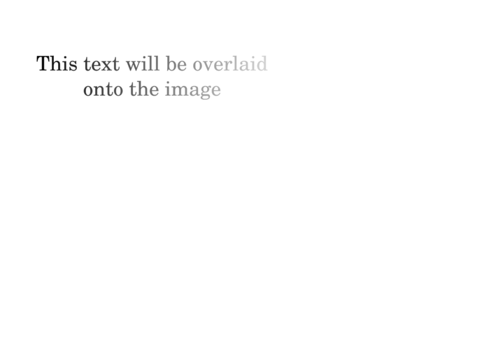

# Raspberry Pi NEON Compositor

Uses NEON SIMD instructions to overlay a foreground image with an alpha channel
(transparency) over a background image really quickly.

## Documentation

[**Documentation**](https://tttapa.github.io/ARM-NEON-Compositor/Doxygen/index.html)

The [**modules**](https://tttapa.github.io/ARM-NEON-Compositor/Doxygen/modules.html)
page is the best place to start.

You can find more in-depth explanations of the NEON intrinsics used by this 
library here: [**Raspberry-Pi/NEON**](https://tttapa.github.io/Pages/Raspberry-Pi/NEON/index.html).

## Examples

The [`overlay_alpha`](https://tttapa.github.io/ARM-NEON-Compositor/Doxygen/dc/d0e/examples_2overlay_alpha_2overlay_alpha_8cpp-example.html)
example overlays a foreground image with an alpha channel onto a background
image, for example:

| Background | Foreground | Result |
|:----------:|:----------:|:------:|
|  |  |  |

## Performance

The following two graphs experiments compare the performance of overlaying one
image onto another with GCC's `-O3` optimization level on the one hand, and with
the hand-crafted NEON intrinsics on the other hand. Especially for small images,
the difference in performance is huge, for larger images, memory throughput and
caching effects starts to become more important factors than raw processing
power.

| Small images | Large images |
|:------------:|:------------:|
|  |  |

The experiments were carried out on a Raspberry Pi 3B+ running Ubuntu 20.04 
(64-bit).